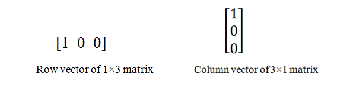

This experiment helps students in learning two important ideas in linear algebra: rank and nullity. Through this experiment, students will explore subspaces of vector spaces such as null space and range. Simple examples are given to make students understand what these mean and why these matter. Relation between rank and nullity has also been given to find one with the help of the other.
#### 1. Row and column vector:
Let A be a matrix of order m×n. Then there are m rows and n columns. Each row gives a matrix of order 1×n and is known as a row vector. Similarly, each column gives a n×1 matrix and is known as a column vector. A row vector can be considered as an element of Rn and column vector can be considered as an element of Rm.Conversely, an element of Rn can be considered as a column matrix (or column vector)/ row matrix (or row vector) of order n×1/ 1×n.

#### 2. Null space	
##### 2.1. Null space of a linear transformation: 
Let V and W be vector spaces over the field R and let T:V→W be a linear transformation. Then the null space of T is defined as the set of vectors x&isin;V such that T(x)=0 and is also known as kernel of T. It is denoted by N(T) or ker(T). Thus N(T)={ x&isin;V|T(x)=0}. By definition, N(T) is a subspace of V.
##### 2.2. Null space of a matrix:
Let A be a matrix of order m×n. Then the null space of a matrix A is the set of all x in Rn (expressed as columns vectors) that satisfy the equation Ax=0, where 0 is the zero vector of Rn.
##### 2.3. Nullity: 
Let V and W be finite dimensional vector spaces over R and let T:V→W be a linear transformation. Then dimension of its null space (a subspace of V) is called the nullity of T. It is denoted by η(T).
Let A be a matrix of order m×n. Then dimension of its null space is called the nullity of A. It is denoted by η(A).
##### 2.3.1. Examples:
(i). Consider the linear transformation T:R2→R2 such that T(x, y)=(x, -y), where x, y&isin;R. Then nullity of T is zero because its null space is {(0, 0)}.  
(ii). Consider the linear transformation T:R2→R2 such that T(x, y)=(x, 0), where x, y&isin;R. Then nullity of T is one because its null space is {(0, α): α&isin;R}, where α&isin;R.  
(iii). Nullity of the zero transformation is 0.  
(iv). Let A= be a matrix of order 2×2. Then nullity of A is zero because its null space is {(0, 0  
(v). Let A=, where a, b are non-zero real numbers, be a matrix of order 2×2. Then nullity of A is two because its null space is {(a, b): a, b&isin;R}.  
#### 3. Range: 
Let V and W be vector spaces over a field R. Let T:V→W be a linear transformation. Then the range of T is defined as set of vectors α&isin;W such that α=T(x), for some x&isin;V which is denoted by R(T). Thus R(T)={T(x)&isin;V : x&isin;V}. By definition, R(T) is a subspace of V.
##### 3.1. Rank: 
Let V and W be finite dimensional vector spaces over R and let T:V→W be a linear transformation. Then dimension of its range(a subspace of V) is called the rank of T. It is denoted by ρ(T). 
Let A be matrix of order m×n. Then rank of a matrix A is the maximal number of linearly independent row or column vectors. It is denoted by ρ(A).
##### 3.2. Remark: 
Let A be a matrix of order m×n and T:V→W be an associated linear transformation with respect to a given pair of bases. Then by definition it is immediate that rank of A is same as the rank of T. Hence change of basis does not affect rank. Same holds for nullity.
##### 3.2.1 Examples:
(i). Consider the linear transformation T:R2→R2 such that T(x, y)=(x, -y), where x, y&isin;R. Then rank of T is 2 because its range is {(α, β): α, β&isin;R}.  
(ii). Consider the linear transformation T:R2→R2 such that T(x, y)=(x, 0), where x, y&isin;R. Then rank of T is one because its range is {(α, 0): α&isin;R}. 
(iii). Rank of the zero transformation is 0.  
(iv). Let A= 

$$\begin{pmatrix}a & b \\\ c & d\end{pmatrix}$$

where a, b are non-zero real numbers, be a matrix of order 2×2. Then rank of A is 2.  
(v). Let A=

$$\begin{pmatrix}0 & 0 \\\ 0 & 0\end{pmatrix}$$

be a matrix of order 2×2. Then nullity of A is 2.

#### 4. Rank-Nullity theorem: 
Let V and W be finite dimensional vector spaces over R and let T:V→W be a linear transformation. Then ρ(T)+η(T)=Dim V.
##### 4.1. Example: 
Let T:R2→R3 be a map defined as T(x, y)=(x, y, x+y). We find the rank and nullity of T. One can easily verify that T is a linear transformation. Now, consider the standard basis of R2. Then T(1, 0)=(1, 0, 1) and T(0, 1)=(0, 1, 1). Thus the range(T) is a subspace of R3 spanned by the vectors (1, 0, 1) and (0, 1, 1). These vectors are linearly independent which implies that rank(T)=2. By rank-nullity theorem, ρ(T) + η(T) =Dim(R2). This implies that η(T)=2-2=0. Thus nullity of T is zero. Alternatively, to find the nullity, notice that null space T= {(0, 0)}.

this is just a test $ \begin{pmatrix} a & b \\ c & d \end{pmatrix} $

$$
\begin{pmatrix}
a & b \\
c & d
\end{pmatrix}
$$

this is test \(A = \begin{pmatrix} a & b \\ c & d \end{pmatrix} \)

This is a paragraph and here is the matrix $ \begin{pmatrix} a & b \\ c & d \end{pmatrix} $ continuing the same line.

